# Confidential VMs (CVMs)

## Abstract

This document addresses the question: **How can we protect the code, data, and cryptographic keys of applications against a range of adversaries** (see A1–10 defined below)?

Our focus is on leveraging **new CPU features** to protect both existing and new applications in a way that is **effective** and **efficient** — that is, *without* requiring:

1. Re-engineering of the applications  
2. Retraining of administrators or developers  
3. Significant slowdowns during deployment or at runtime
4. Significant increase in computing resources during runtime

To this end, we analyze the strengths and weaknesses of existing approaches (O1–5) and evaluate them against the adversary models relevant to our context — such as those encountered in the **eHealth** domain—to help define our **target design objectives** (T1–2).

Based on this analysis, we derive a set of **requirements** for the underlying infrastructure (R1–9) and for the **confidential computing runtime environment** (D1–6).

## Introduction

**System security** involves safeguarding computer systems against unauthorized access, modification, or erasure. It emphasizes a bottom-up approach to building secure systems.

At the core of this model is the **hypervisor**, which is trusted to isolate and protect the host from potentially untrusted workloads through [sandboxing](#types-of-virtual-machines). The hypervisor runs workloads inside **virtual machines (VMs)**, each acting as a sandbox that restricts a workload's access to the host and to other VMs on the same server. DPUs (Data Processing Units) are common in modern servers. These help hypervisors by offloading and accelerating key networking, security, and storage functions traditionally handled by the host CPU. This significantly improves performance, isolation, and efficiency in virtualized environments.

Inside each VM, the **guest operating system** further isolates applications, protecting itself and other applications from any that may be compromised or malicious.

Today, organizations increasingly outsource their computing infrastructure, software management, and in some cases, even the operation of applications to external providers. This outsourcing means that these providers become part of the [**trusted computing base (TCB)**][24], meaning we must rely on them—and their teams—to protect the application's **data**, **code**, and **cryptographic keys**.

Traditionally, companies have used legal agreements to enforce these protections. However, legal mechanisms have limitations, especially when dealing with providers in different jurisdictions or those lacking advanced technical capabilities needed to ensure proper security.

Even with advanced capabilities, honest configuration mistakes are common due to the growing complexity of modern cloud-native systems. Simple errors—such as leaving an S3 bucket publicly readable—occur frequently and can lead to serious security risks. On the other hand, limiting the access can lead to unexpected behavior in the sense that it is not always obvious why certain operations are not permitted anymore. Finding the right balance in the security policies can be difficult to achieve.

A common way to attack a system is by gaining access to the credentials of users with elevated privileges, such as system and security administrators - who are permitted to adjust security policies. An adversary could use this to adjust policies to gain access to data. Credentials can be stolen—or, in some cases, simply bought from the users. This can have a significant [monetary impact][30] and cannot always be stopped by requiring Multi-Factor Authentication (MFA).

To address these issues, we need an approach that is:

- [**Secure by default**][32], minimizing the potential for misconfiguration and reducing the burden on developers and operators.
- Based on the **[N-Person Rule][31]**, ensuring that all critical operations require the involvement of multiple individuals, preventing any single person from being able to compromise the system.

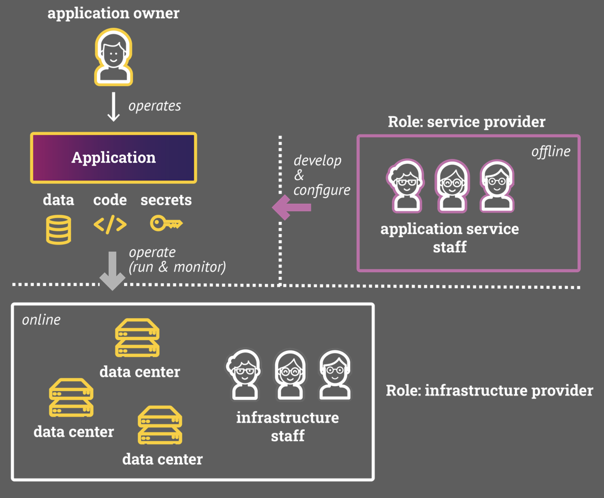

### Reducing the Trust in System Software

System software—such as the hypervisor, operating system, and Kubernetes—has access to application resources. For example, the operating system can read all of an application's data, code, and cryptographic keys because it has permission to access the application's memory.

With this level of access, an adversary who compromises the operating system can view all files and intercept network traffic, even if the application encrypts its data. This is because the encryption keys are typically stored in memory, allowing the attacker to extract them and decrypt the protected data.

System software is inherently complex and difficult to secure. Studies of the Linux kernel show that there are consistently [thousands of known vulnerabilities][20], including hundreds classified as [critical][25]. At the time of writing, there were 8,018 documented vulnerabilities in the Linux kernel.

According to estimates by Google, at any given time, at least 500 of these vulnerabilities are [exploitable][25], even with continuous patching efforts. On average, a kernel vulnerability remains undetected and unpatched for about [3.6 years][19]. This long window of exposure allows adversaries to exploit such flaws through **zero-day attacks**, posing a serious threat to systems relying on the kernel for isolation and security.

One of the underlying problems is the use of unsafe programming languages like C and C++. Studies in the context of [Android][21] indicate that transitioning to safe programming languages like Rust eliminates an entire class of vulnerabilities. For instance, Google reports that it has [not found any memory safety violations][21] in Rust code so far. While Rust code can still contain vulnerabilities, their severity is, on average, [lower][21].

There is an ongoing effort to introduce [Rust into the Linux kernel][22]. As of late January 2025, the Linux kernel codebase has surpassed 40 million lines of code. About [98.5%][23] of the kernel code is written in C.  The fraction of Rust code inside the Linux kernel is, however, tiny; it is less than [0.1 percent][23] of the code base.

To address the issues introduced by outsourcing and the use of unsafe programming languages, the goal is to eliminate external providers and remove as many unsafe components as possible from the Trusted Computing Base (TCB). Ideally, all components within the TCB should be written in safe programming languages like Rust to reduce the risk of memory safety vulnerabilities.

However, removing components written in unsafe languages—such as the Linux kernel—from the TCB is not straightforward.

**Confidential computing** focuses on protecting the integrity, confidentiality, and consistency of applications. It ensures that the **data**, **code**, and **keys** of applications are safeguarded against unauthorized access—even from privileged components like the hypervisor and the operating system. As such, confidential computing provides a way to remove components like the OS kernel and the hypervisor from the Trusted Computing Base (TCB). To remove external providers from the TCB, they must **not** have access to the application's data, code, or keys.

With confidential computing, the owner of an application should be able to:

1. Outsource the management of the computing infrastructure, system software, and the application itself to external providers, while  
2. Still protecting the application against various adversaries (see below for details).

Ideally, the TCB of an application consists **only** of the application code.

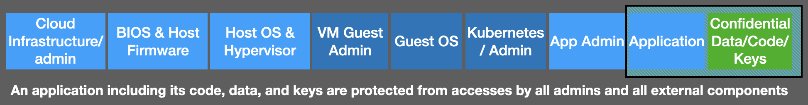

To protect an application, one must prevent external software and hardware—such as devices with DMA (Direct Memory Access) and external providers—from accessing the application. This can be achieved with the help of [**trusted execution environments** (TEEs)][1]. TEEs use memory encryption to ensure the **confidentiality** and **integrity** of the application's data, code, and keys:

- **Confidentiality**: Any read access from outside the TEE is either blocked or returns encrypted data.
- **Integrity**: Any unauthorized write access is either blocked or causes an error the next time the TEE attempts to access the data.

Ideally, the TEE also ensures:

- **Consistency**: When an application reads data from (main) memory or disk, it receives the data that was most recently written. Ensuring consistent memory in the presence of a [Skilled Hardware Adversary](#limiting-the-power-of-adversaries) requires tracking the latest writes using metadata structures such as a [Merkle Tree][26]. However, maintaining and verifying this metadata introduces runtime overhead. As a result, current CPUs do not provide consistency protection against Skilled Hardware Adversaries.

This document investigates how to support confidential computing across various CPU architectures (AMD, ARM, Intel) without requiring re-engineering of applications. The goal is to:

1. Reduce The cost of transforming an application into a confidential application, and
2. The time to market.
3. Ensure advanced security by default.  

Achieving both CPU portability and full support for legacy applications is only possible with **Confidential VMs** (see [Section: TEEs](#background-tee-types)), as this is the only technology supported across all major CPU vendors.

The use of Confidential VMs must not compromise security, nor should it increase development or runtime costs compared to process-based approaches such as [Intel SGX][3]. This presents a challenge, as process-based approaches offer a much smaller TCB, faster startup times, and lower resource usage.

To introduce these challenges and their context, we begin with a background section covering basic concepts related to virtual machines and confidential computing.

## Background: Virtual Machines

A [Virtual Machine (VM)][27] emulates a physical server (also known as a host) using system software and CPU extensions. Like a physical server, it can run programs, execute operating systems, store data, and connect to networks—but it does so using virtualized resources instead of actual hardware components.

### Types of Virtual Machines

Virtual machines serve as sandboxes for application workloads, isolating applications from one another. While *isolation* and *sandbox* are sometimes used interchangeably, in the context of confidential computing, it's important to distinguish between the two terms more carefully:

- **Sandboxing** creates a controlled environment for running applications or processes. It's like a temporary, software-defined compartment that restricts what a program can do, but relies on the hypervisor (VM context) or the operating system (container context - see below) for enforcement. In a nutshell, sandboxing protects the **outside** from the **sandboxed environment**.

- **Isolation** creates a complete separation between systems or components. In the context of VMs, it is like having separate physical computers - even if one system is compromised, it cannot access the isolated environment. Isolation protects the isolated environment from the outside. In the context of VMs, the hypervisor isolates the host by running all VMs in sandboxes.  In the context of confidential computing, the isolation of an application means that access to the application by the environment is not permitted.

The difference between traditional VMs and confidential VMs could be characterized as follows:

- In traditional VMs, the hypervisor provides isolation indirectly by running each VM in a sandbox.
  
- In confidential VMs, isolation means that the application is shielded from the host OS and hypervisor entirely. Access to the application's memory, data, and code is **not permitted** even by privileged components.

### Real-World Support for Confidential Computing

| Technology     | Vendor | Type            | Description                                                                 |
|----------------|--------|------------------|-----------------------------------------------------------------------------|
| **Intel SGX**  | Intel  | Enclave (TEE)    | Hardware-based isolation of app enclaves from OS/hypervisor.               |
| **Intel TDX**  | Intel  | Confidential VM (CVM)  | Full VMs with memory and state isolated from host software.                |
| **AMD SEV**    | AMD    | Confidential VM (CVM) | Encrypts VM memory; prevents hypervisor access to guest data.              |
| **ARM CCA**    | ARM    | Realm/Conf. VM  (CVM)  | Isolated execution environments enforced by hardware Realms.               |

One of the main questions in confidential computing is: **At what level should applications be isolated?**  
Should isolation occur at the **process level**, **container level**, or **system level**?

At first glance, one might draw the following conclusions:

- The **smaller** the isolation boundary (e.g., per process), the **smaller the Trusted Computing Base (TCB)** and the **greater the potential to outsource** the management of system components.
- The **larger** the isolation boundary (e.g., full system), the **easier it becomes** to run an application in a confidential fashion without needing significant changes.

However, in practice, **neither of these hypotheses are true**. Each isolation level comes with its own trade-offs in terms of security, performance, portability, and management overhead. To understand these trade-offs, we need to examine the advantages and disadvantages of different design choices more closely.

### Full Virtualization

Full virtualization has the following properties:

- Provides a complete emulation of a physical computer.
- Can run entire operating systems independently.
- Managed by hypervisors that share and allocate hardware resources.
- Enables multiple isolated environments on the same physical machine.

Virtual machines are **sandboxes**—they are **isolated** both from the host system and from one another. The core idea is to protect applications by sandboxing them using VMs.

This model offers two key protections:

1. The **host OS is protected** from potentially malicious applications running inside VMs.
2. **Other applications** on the same physical host are protected from one another.

In this way, virtualization enforces strong isolation boundaries, even when workloads are colocated on shared infrastructure.

The architecture of virtual machines and their relation to the host can be visualized as follows:

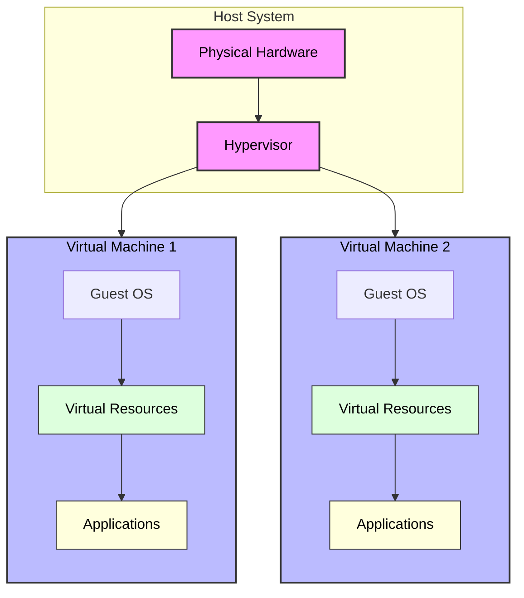

The host system (pink) contains the physical hardware and hypervisor that manages all virtual machines. Each virtual machine (aka guest) represents a sandboxed runtime environment (light gray boxes). Green boxes show virtual resources (CPU, memory, storage) allocated to each VM. Yellow boxes represent applications running within their sandboxed environment. The arrows demonstrate how resources flow through the hypervisor to maintain isolation. The guest OS manages the virtual resources and provides them to the application.

Virtual machines (VMs) do not share resources with each other; instead, they **compete for the physical resources** available on a host. The hypervisor or VM scheduler can **overbook** physical resources, scheduling based on **expected or measured usage** rather than each VM’s maximum resource allocation. In general, using **containers** instead of **virtual machines** can significantly reduce the **resource footprint** of applications. A study by IBM indicates that resource usage of a VM-base application was by a factor of up to 4 higher.

Containers share the host operating system kernel, which eliminates the need to run a full guest OS per application, resulting in lower memory and CPU overhead.

#### VM Migration

When the host runs low on resources, a VM scheduler can take various actions:

- **Throttle** or **pause** lower-priority VMs
- **Migrate** VMs to other hosts
- **Stop** VMs if necessary

**Migration** of VMs is used not only for load balancing but also for **system maintenance**, such as updating host software.

- **Live migration**: Moves a VM while it is still running. This reduces downtime but introduces **temporary performance overhead** during the migration.
  
- **Cold migration / Snapshot + Restart**: The VM state is **snapshotted**, the VM is stopped, and then it is restarted on another host. This causes **greater disruption** but can be simpler in certain update scenarios.

> Note: Live migration helps update the **host system software**, but **not** the software running *inside* the VM.

#### Cloud-Native Context

In environments like **Kubernetes**, cloud providers must regularly update:

- The **host OS**
- The **VM's system software**
- **Kubernetes control plane and agents**
- The **application workloads**

In this setting, it is often more practical to **replace VMs** instead of migrating them. This leads to the concept of **node rolls**, where old nodes are terminated and replaced by new nodes.

> **Cloud-native applications** must be designed to tolerate such node replacements, enabling high availability and resilience during upgrades or scaling operations.

#### Benefits of Virtual Machines

The main advantages of VMs are:

- **Sandboxing**: Even a malicious VM cannot attack the host or other VMs on the host.
- **Flexibility**: Multiple operating systems can run simultaneously on the same host, i.e., each VM (aka guest) has its own guest OS.
- **Resource Management**: Efficient sharing of physical hardware.
- **Migration Capabilities**: VMs can be moved between different physical hosts.
- **Snapshot Capabilities**: Ability to capture and restore VM states.

Note that in the context of cloud-native applications, migration and snapshots of VMs is less important. In what follows, we therefore do not discuss VM migration or VM snapshots.

### Process Virtual Machines

An alternative to **(System) Virtual Machines** are **Process Virtual Machines (PVMs)**:

- Run as normal applications within an operating system.
- Focus on executing programs in **platform-independent environments**.
- Provide a **high-level abstraction** for programming languages.
- Examples include:
  - **Java Virtual Machine (JVM)**
  - **.NET Common Language Runtime (CLR)**
  - **[WASM (WebAssembly) runtime environments][28]**

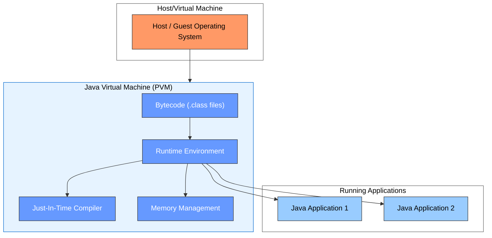

In what follows, we will use the acronym **VM** to refer to a **System Virtual Machine**, and **PVM** to refer to a **Process Virtual Machine**.  

We will explore the differences between VMs and PVMs in the context of **confidential computing** in [Section: Enclaves](#confidential-pvm-vs-confidential-vm).

## Background: Containers

Containers and Virtual Machines (VMs) are both virtualization technologies, but they operate at different levels and serve distinct purposes.  

**Containers** share the operating system kernel and run as isolated user-space processes. They follow the [OS-level virtualization][15] paradigm, offering lightweight isolation with high performance and efficiency for application deployment.

In contrast to a **Process Virtual Machine (PVM)**, which represents a single OS process, a **container** can include multiple processes.  

- A **container** can run directly on a host OS or inside a virtual machine (VM), meaning the underlying OS can be either a **host** or a **guest** OS.
- A **PVM** can run within a container

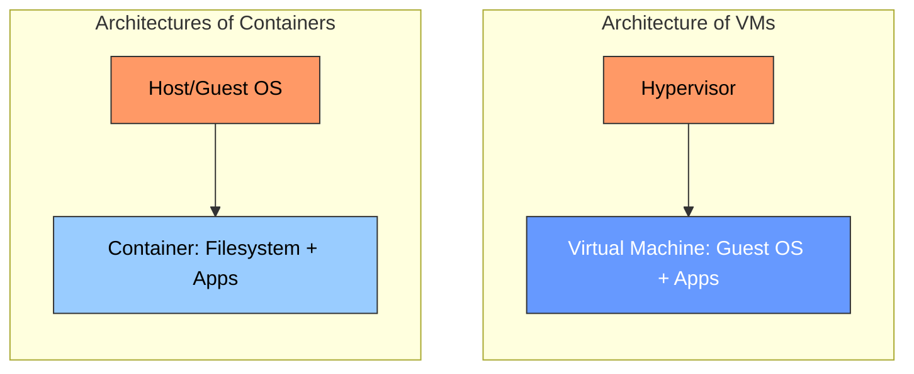

#### Advantages of Containers

Containers offer several benefits, especially in cloud-native and microservices environments:

- **Fast startup times** – Containers can be launched in seconds.
- **Lightweight and efficient** – Minimal overhead compared to virtual machines.
- **Optimized resource usage** – Better utilization of CPU and memory.
- **High density** – Multiple containers can efficiently share resources on the same OS.
- **Simplified deployment** – Easy to package, distribute, and deploy applications consistently across environments.

#### Disadvantages of Containers

While containers offer many advantages, they also come with certain limitations:

- **Limited OS flexibility** – Containers typically require a Linux-based environment, meaning applications must be compatible with a Linux kernel or a Linux-like runtime. Running non-Linux workloads is more complex and often less efficient.

- **Shared kernel vulnerability** – All containers on a host share the same kernel. If the host or guest OS kernel contains vulnerabilities, **all containers** may be exposed. Conversely, this also means that all containers benefit from prompt kernel updates and patches.

- **Weaker isolation compared to VMs** – Container isolation is primarily enforced by the operating system through namespaces and cgroups, which can be less robust than the hardware-backed isolation provided by VMs.  

#### Comparing Containers and Virtual Machines

| Aspect                   | Containers                     | Virtual Machines               |
|--------------------------|--------------------------------|--------------------------------|
| Resource Overhead        | Low (shared OS kernel)         | High (full guest OS overhead)  |
| Density per Host         | High                           | Lower                          |
| Startup Time             | Seconds                        | Minutes                         |
| Cost Efficiency          | High                           | Lower                          |
| Power Consumption        | Lower                          | Higher                          |
| Performance Variability  | Slightly better in many cases  | Higher isolation but slower     |

In practice—particularly in **Kubernetes environments**—a common strategy is to combine both technologies:  
  Each **Kubernetes node** runs inside a **VM** to benefit from strong isolation, while **containers** within each node are used to isolate application processes more efficiently.

**[IBM case study with Red Hat OpenShift][33]**. In a simulated banking workload, IBM found that containerized environments packed significantly more throughput than VMs on the same x86 hardware. They observed over 4× more containers than VMs, yielding roughly 4× higher throughput with reduced response times and infrastructure needs. As a result, infrastructure costs were much lower when using containers to deliver equivalent performance.

In the context of confidential computing, the approach known as [**CoCo**][34] maps **pods** to individual **Confidential Virtual Machines (CVMs)** (see detailed CoCo description below).  

In many real-world scenarios, a pod contains only one or two containers. When each pod is mapped to a separate CVM, the **resource efficiency**, **cost savings**, and **throughput advantages** typically associated with containers are significantly reduced.  

This is because each pod effectively becomes as heavyweight as a full virtual machine, negating the usual benefits of container density and lightweight isolation.

## Hardware Support for TEEs

At the CPU level, [**Confidential Computing**][2] is a technology designed to protect **data**, **code**, and **keys** at runtime by creating a secure, **isolated** environment within the processor.  

This isolated environment—known as a [**Trusted Execution Environment (TEE)**][1]—prevents unauthorized access or inspection of sensitive information, even from privileged system components like the operating system or hypervisor.

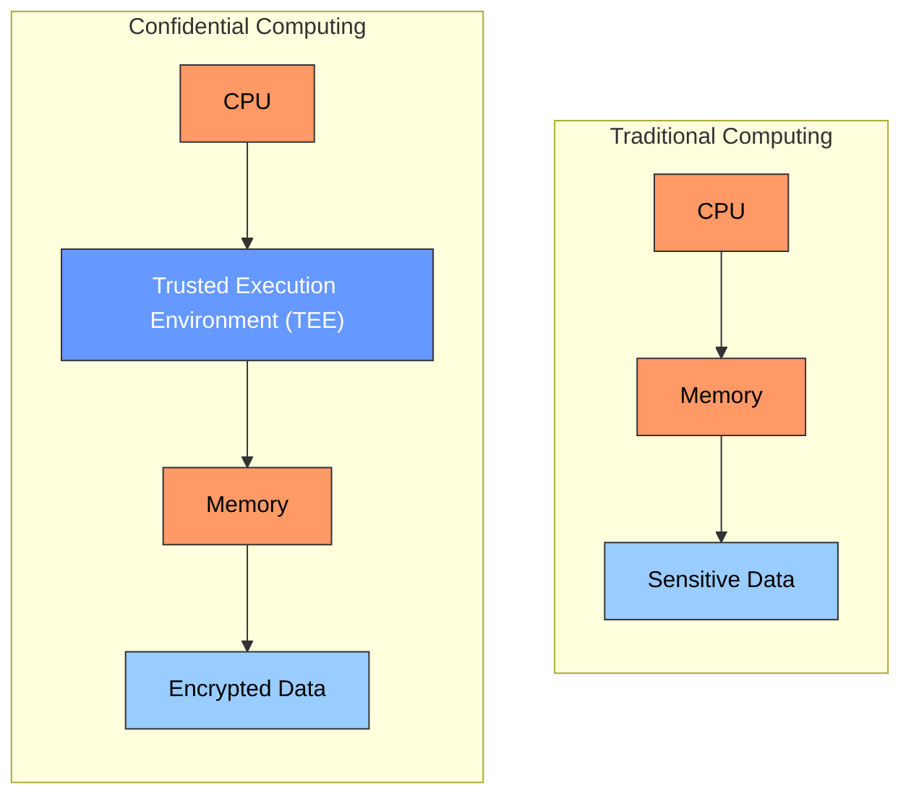

### Background: TEE Types

CPUs support different types of **Trusted Execution Environments (TEEs)**. The two main types are:

#### Enclaves

- **Enclaves** are encrypted memory regions bound to a specific **process**.
- An enclave can contain **code**, **data**, and **keys**.
- Code executing inside the enclave accesses memory in **plaintext**, while the CPU transparently **decrypts on reads** and **encrypts on writes**.
- **No code outside** the enclave (including the OS or hypervisor) can access the enclave’s contents.
- Enclaves are supported by [**Intel SGX**][3].

> Enclaves ensure that even privileged system software cannot read or alter their contents. The encryption key is randomly generated and remains only within the CPU, making it inaccessible to external devices (e.g., DMA attacks are mitigated).

####  Confidential Virtual Machines (CVMs)

- **CVMs** protect entire **virtual machines**, including the **guest operating system** and all applications running inside.
- CVMs shield their internal software from any **external system software**, such as the host OS or hypervisor.
- However, CVMs **do not isolate applications** from the **guest OS** inside the VM. That means the OS within the CVM can access all memory of applications running inside it.
- CVMs are supported by:
  - [Intel TDX][4]
  - [AMD SEV-SNP][5]
  - [ARM CCA][6]

### Enclave Inside CVM: Not Supported

Currently, **nesting enclaves inside CVMs** is **not supported**. For example, you cannot create Intel SGX enclaves within Intel TDX CVMs.

> This type of nesting would be useful to achieve dual protection:
>
> 1. **Application isolation** from the guest OS via enclaves.
> 2. **System isolation** from the host via CVMs.

However, such combinations are not feasible with current hardware architectures.

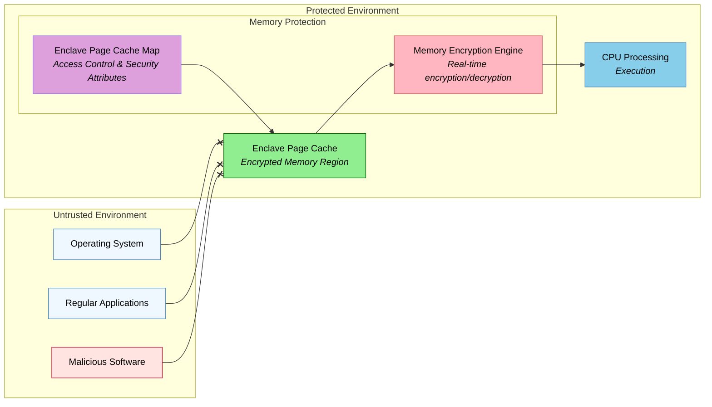

Intel SGX enclaves provide hardware-based protections which provide

- Isolation from OS and hypervisors
- Protection against privileged software attacks
- Secure key management within CPU package
- Runtime Security - enclaves cannot be debugged, even with hardware debuggers
- Memory encryption keys change with each power cycle
- Secure entry/exit mechanisms prevent unauthorized access
- Context protection during interrupts and exceptions

There are known attacks on enclaves that one needs to protect against:

- Side-channel attacks, in particular, cache-based attacks have been demonstrated
- Speculative execution vulnerabilities affected SGX

Most of the demonstrated vulnerabilities have been addressed by newer CPUs, new CPU instructions like *AEXNotify*, and updated firmware. When running an application, we need to verify that the TEE indeed has installed all the newest mitigations for the known vulnerabilities. This check is performed with the help of **attestation** (see below).

There are several shortcomings regarding the design of SGX enclaves. In the context of this document, the most important ones are:

- applications need to be transformed since system calls are not permitted inside the enclaves (E1),
- shared memory between process-based enclaves is not supported (E2),
- no hardware isolation inside of enclaves to isolate an **enclave runtime** (needed to run the application inside the enclave) from the application (E3), and
- no separate attestation of the application and the runtime (E4).

CPUs provide TEEs in form of enclaves and/or CVMs. Enclaves can be seen as a **Confidential PVM**, i.e., an enclave isolates individual processes. A CVM isolates a VM from the hypervisor, i.e., the hypervisor cannot access the memory of the CVM. However, the guest OS running inside the CVM can access the data of all applications running inside of the CVM.

To be able to compare **Confidential PVM** and **CVMs**, we first define the power of the adversaries that we need to protect our applications against.

## Background: Threat Model

A **threat model** is a systematic process of identifying, analyzing, and documenting potential security threats to a system, application, or infrastructure. It helps organizations understand their security vulnerabilities and develop appropriate countermeasures to protect their assets.

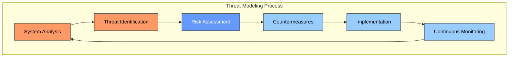

[Secure by design][13] is a software engineering principle that should be followed by all applications. However, threats are changing over time and hence, one needs to reevaluate the threat analysis during the whole lifetime of an application.

For example, by outsourcing components of the computing infrastructure, an application owner might need to address new kind of threats like that one cannot trust certain components anymore - like the hypervisor or the database.

Hardening an application against new threats can be difficult and expensive because it might require a re-engineering of the application. All applications have external dependencies, i.e., they are using external libraries and services, these dependencies need also be hardened against new threats.

Confidential computing can reduce the cost of protecting an application against various threats. In a nutshell, the confidential computing infrastructure isolates an application to mitigate certain threats. In other words, an application owner can focus on threats that are specific to the application and delegates a set of generic threats (see [next section](#aversary-models)) to the confidential computing infrastructure.

For example, if an application does not support network encryption, one can switch on end-to-end network encryption via its security policy and the help of the confidential computing infrastructure. If an application supports network encryption but does not have a secure way to provision the keys and certificates of an application, one could provision these keys and certificates via security policies.

In summary, **an application owner can address certain threats in a declarative way**, i.e., via security policies, instead of re-engineering the software of the application. This can reduce the costs of protecting an application. We introduce the set of threats that can be addressed in this way in the next subsection.

### Adversary Models

One part of a threat model is to identify the adversaries, i.e., who might try to read or modify the data, code, or keys of an application and what access rights do the adversaries already have. We assume the following adversary models A1-A10.  This is an extension of the [Adversary Models][12] proposed by Intel:

- **(A1)** **Unprivileged Software Adversary**: We assume that an adversary might be able to run user code on the same computer. There are multiple variants possible:

  - **(A1.1)**: the adversary has unprivileged access on the different VM running on the same host.
  - **(A1.2)**: the adversary has unprivileged access on the host OS,
  - **(A1.3)**: the adversary has unprivileged access on the Kubernetes node running the application,
  - **(A1.4)**: the adversary has unprivileged access on the containers that run the application code.

- **(A2)** **System Software Adversary**: We assume that an adversary has administrators' credentials with root access to the system software at various levels. Adversaries might coerce admins to perform certain actions like copying or modifying data or code at the system and the application level. For example, the adversary could replace the application by a different application or an old version of the application that has a known bug.

  - **(A2.1)**: the adversary has privileged access on the different VM running on the same host.
  - **(A2.2)**: the adversary has privileged access on the host OS,
  - **(A2.3)**: the adversary has privileged access on the Kubernetes node running the application,
  - **(A2.4)**: the adversary has privileged access on the containers that run the application code.

- **(A3)** **Startup Code/SMM Software Adversary**. The System Management Mode (SMM) is a privileged execution mode in x86 processors that allows the system firmware to perform low-level hardware management functions of the host, such as power management and hardware control, without directly interfering with the operating system. We assume that an adversary can modify the code initially booted on the server and change the code of the system management mode.

    The adversary might also gain access to the servers via the BMC (Baseboard Management Controller).The BMC allows administrators to monitor hardware status, flash BIOS/UEFI, provide console access, and control power cycles. The adversary might rollback the BIOS/UEFI to an older version with known bugs.

- **(A4)** **Network Adversary**. We assume that an adversary with access to the network can send arbitrary messages. The network adversary can communicate with applications to gain access to application data or trigger bugs in the application to gain control over the application. Moreover, the network adversary can intercept all network traffic and can even modify arbitrary network traffic.

- **(A5)** **Software Side-Channel/Covert-Channel Adversary**: an adversary could try to extract secrets and keys from an application or a CVM using side channels that circumvent the protections of the TEE. Common side channels are cache probing attacks that measure the latency of L1/L2/L3 cache accesses to determine if an application has accessed certain cache lines.

- **(A6)** **Simple Hardware Adversary**

  - **(A6.1)** The adversary can remove DRAMs, has tools for hardware debugging, and can listen to buses.

  - **(A6.2)** The adversary gets hold of decommissioned or in-use host. For example, the host might not have been wiped when the hardware or service is decommissioned. The adversary recovers a CPU, TPM, and database. **Note**, the adversary must not be able to read the database despite having a functioning host and the DB.

- **(A7)** **Roll-Back State Adversary**

  - **(A7.1)** The adversary can roll back the disk state. The disk state might contain an encrypted database with keys that have been updated already.
  - **(A7.2)** The adversary can roll back the CPU firmware or the application code. The adversary can install an old version of the CPU firmware to exploit known bugs in the TEE implementation. An adversary could use this to extract information from, say, an encrypted key database.
  - **(A7.3)** The adversary can freeze the state of an existing application. This is to keep access to an earlier version of the database.

- **(A8)** **CVE Adversary**: The adversary knows all components of an application, i.e., all dependencies and their versions of each of the application services are known. The adversary knows all the vulnerabilities that affect these components and will exploit these vulnerabilities to attack the application.

- **(A9)** **Insider Attack**

  - **(A9.1)** Insider attack from the security team: Attacker has credentials to access security policies and configuration files and might try to change policies to grant access to data, code, and secrets.
  - **(A9.2)**  Insider attack from the application development team: A developer might add code to send data via the network or to the filesystem.
  - **(A9.3)**  Insider attack from the application development team: A developer extends the functionality such that specific user request gain access to data of other users.

- **(A10)** **Configuration Attacks**
  Configurations can modify the behavior of an application. Configurations often include declarations the define which and how to to provision key materials to an application. This could be exploited by an adversary to gain access to the keys of an application:

- **(A10.1)** An adversary might try to read the configuration of an application to extract secrets (e.g., keys) that are used by the application.

- **(A10.2)** An adversary might try to modify the configuration of an application to gain access to the application's data, code, and keys. For example, the adversary might instruct the application to use a key that is known by the adversary.

- **(A10.3)** An adversary might try to exploit errors and weaknesses in the application's configuration, e.g., tries to identify gaps in the configuration to attack the application.

## Limiting The Power of Adversaries

We limit the power of the adversary by not considering the following adversary models in the context of this document:

- *(A11)* *Skilled Hardware Adversary* might modify servers to, e.g., change memory content known the exact representation of encrypted memory.

- *(A12)* *Hardware Reverse Engineer Adversary* might use devices to extract key materials from a CPU.

- *(A13)* *Authorized Adversary*: An adversary that might know the root keys embedded in the CPUs.

## Confidential PVM vs Confidential VM

As stated above, our focus is on protecting applications, i.e., protecting an application's code, data, and keys. Next, we discusses the protection boundaries of CVMs versus enclaves. Our assumption is that the application is *cloud-native* running inside a Kubernetes cluster. The application consists of microservices. Each microservice runs inside of a container. Multiple containers might be clustered together a **pod**. For example, a pod might contain sidecars that provide extra functionality like collecting application-specific logs or probing the liveness of the microservice.

The containers that are executing inside a pod are specified by manifests that are sent to Kubernetes. To isolate the microservices, the application owner might run these inside of enclaves or within a CVMs. A Kubernetes cluster consists of a set of Kuberentes nodes. An application owner might require that Kubernetes is also protected, i.e., each Kubernetes node should run inside of a CVM to isolate Kubernetes from the cloud provider.

There are different variants possible on how to protect Kubernetes and the application. In what follows, we discuss 5 coarse-grain alternatives. For some alternatives, there are different variants possible. Still, one could define even more variants since the design space is quite large. We know that our comparison is not complete. Our main objective is to identify 1) properties of the alternatives that we would like to ensure, and 2) disadvantages that we try to avoid.

As we mentioned above, our objective is to be able to protect against threats in a declarative way. Ideally, by declaring what threats we need to protect an application against. For example, if an application needs encrypted network, we can declare this. If an application already provides network encryption, an application owner might not want to pay for a second layer of network encryption.

The following figure describes graphically the components that an adversary might control:

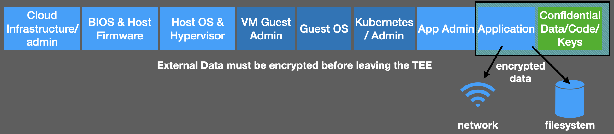

The threat model of the application defines which components one can trust and which components the adversary might control to attack the application. The **Trusted Computing Base (TCB)** is the set of all components that an application needs to trust. It must not contain any components that the adversary might control. The separation between the TCB and its environment is determined by the **Trust Boundary**.

### Establishing Trust

A TEE protects an application's memory during the runtime of the application. However, first, we need to be able to start the TEE and provide the application with its code, data, and keys. Application start and secure configuration introduce some complex technical problems. We describe a set of questions that we need to address

- How are **applications deployed**, i.e., can we just use Kubernetes manifests to deploy cloud-native applications?

- How can we ensure that the correct code runs inside the TEE?

    When a TEE is created, an adversary can read and update the  **code**, **data**, and **keys** embedded in the TEE. For example, an adversary could read the complete initial content of a TEE. An adversary might even be able to modify or replace the initial content. The adversary might try to simulate a TEE, i.e., it might look like the application runs inside an enclave but in reality it runs in a memory region that the adversary controls.

- How can we securely provision data and keys to the TEE?

    When we configure an application using [Kubernetes secrets][7] and [ConfigMaps][8], an adversary controlling Kubernetes could access the application code, the application configuration, and the application secrets.

- How to protect data in transit and at rest

    If our threat model defines that we cannot trust the Kubernetes nor the operating system, we cannot depend on the "native" encryption mechanisms provided by [Kubernetes][9], the operating system, or the network, e.g., using [SmartNICs][10].

- How to protect the trust boundary?

    Consider that the operating system is not part of the TCB. An adversary can therefore read or modify all data that a TEE exchanges with the operating system. For example, data that is read or written to the filesystem could be read or modified by the adversary.

- How can we ensure that an application runs on an up-to-date hardware and software stack?

    An adversary might know all vulnerabilities of all components of the TCB. How can we ensure that all components are up-to-date, i.e., all patches are applied to all components of the TCB?

The above list of concerns is not complete. There are more concerns that we need to address. The list is, however, sufficient to compare different approaches. In general one can state that the stronger an adversary is, the more concerns we must address to protect an application. In what follows, we will address some of these concerns to be able to compare the advantages and disadvantages of the different approaches.

### Comparing CVMs and Enclaves

The following figure describes graphically the difference regarding the 5 alternatives regarding the size of the **Trusted Computing Base (TCB)**, i.e., the set of all components that need to be trusted to protect the application. The separation between the TCB and its environment is determined by the **trust boundary**.

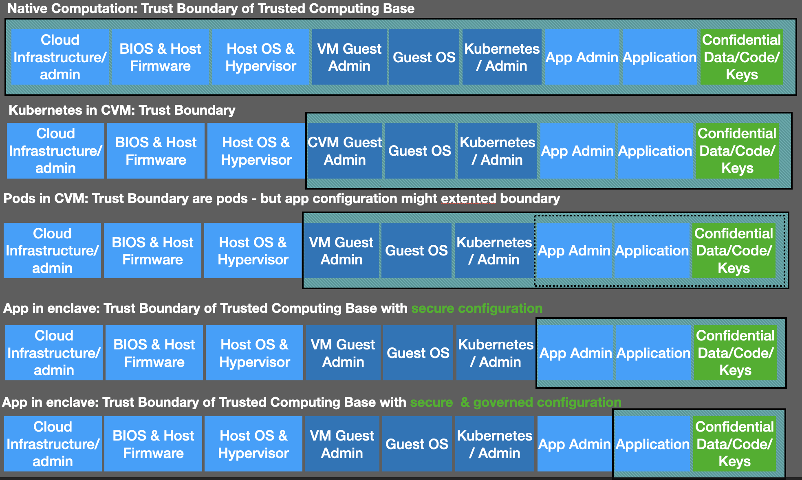

Our objective is that the TCB of an application only contains components that the application owner can trust: There must not exist any component in the TCB that - according to the threat model - is controlled by an adversary of the application.

The exact size of the TCB depends not only by the isolation mechanism provided by the CPU, i.e., an enclave or a CVM, but also on the **APIs** that exist between components of the TCB and its environment. Consider, for example, on how a cloud provider configures virtual machines. Quite often, one provisions general VM images that do not contain specific configuration for the authorized user of this VM. A cloud provider typically injects configurations like the `ssh` public keys of authorized clients and the DNS nameserver into the VM. This is enables authorized clients to connect to the VM via `ssh` and the DNS configuration enables the VM to connect to services in the Internet as well as services provided in the local cloud. Such an injection of configuration data can be done by tools like [`cloudInit`][11]. Injecting one of its own public keys, a cloud provider could gain access to the VM.

In general, one needs to **shield** the interfaces that cross the trust boundary of the TCB. Consider that one uses untrusted components to configure an application. The configuration can modify the behavior of the application, e.g., it can enable or disable encryption: When switching on filesystem encryption, all components that perform the encryption or can access the data or the keys in clear text, become part of the TCB. For each component that becomes part of the TCB, we need to **shield** the APIs that can cross the trust boundary. We also need to ensure that all APIs that are only available within the TCB can only be accessed by components of the TCB.

In summary, the size of the TCB depends not only on the trust boundary provided by the hardware (i.e., enclave versus CVM) but also on the shielding of the APIs that cross the trust boundary. To effectively protect an application, we need to compute the transitive closure of all components that might directly or indirectly be able to control components of the TCB.

In our comparison of the 5 design alternatives, we consider the following APIs:

- Memory access to any component of the TCB (API-MEM),
- Access to all arguments of system calls (API-SYSCALL),
- Kubernetes API to start, configure, operate, and execute cloud-native applications (API-K8s)
- Network communication between components of the TCB (API-Network),
- Filesystem communication between components of the TCB (API-FS).

There are more interfaces that we need to consider (e.g., the above mentioned `cloud-init` API) that are beyond the scope of this comparison.

### Discussion of 5 Design Alternatives (O1-O5)

- **native execution** (O1): if we execute an application inside a native VM, the trusted computing base of the application includes all providers, admins, and the system software of the host and the VMs that run the Kubernetes nodes.

  - **(A1.1)**: Isolation of the application is based on sandboxing all applications. This approach protects against the Unprivileged Software Adversary (A1.1) - assuming that the adversary can run VMs on the same computer but cannot log into the VM of the application.
  - **(A1.2)**: Running as unprivileged user on the host should be tolerated as long as all permissions on the host are properly set.
  - **(A1.3)**: Running as unprivileged user on the Kubernetes node might be acceptable as long as all permissions are properly set.
  - *(A1.4)*: An adversary running as unprivileged user in a container might gain access to all application data. The microservices must - in most application contexts - run using an unprivileged user ID. An adversary that can enter a container will be able to access all configuration and secrets of this microservice since Kubernetes mounts these as files into the container and makes it accessible by the unprivileged user.

  - **(A2.1)**: This approach protects against the Privileged Software Adversary (A1.1) that are located in a different VMs on the same computer.
  - *(A2.2-A2.4)*: An adversary that has privileged access to the host OS, the same VM, or the containers of the application, can typically access all data of an application.

- **Kubernetes nodes in CVMs** (O2): When running each Kubernetes node in a CVM, the TCB of the application can be reduced. We can exclude the cloud infrastructure provider, the BIOS and host firmware, the host OS and the host hypervisor from the TCB.  

  In comparison to option (O1), one can address the following adversary models:

   - **(A2.2)**: One can prevent root users of the host to enter the CVMs.
   - **(A3)**: Attacks on the Startup Code can be tolerated since the CVMs are isolated from the host.
   - **(A5)**: Cache-based side-channel attacks are effectively protected against assuming that caches are properly partitioned between the CVMs.
   - **(A6)**: CVMs protect against a simple hardware adversary.
   - **(A10)**: Since Kubernetes and its admins are considered as part of the TCB, Kubernetes protects against configuration attacks.

  - *(A1.4)*: An adversary running as unprivileged user in a container might gain access to all application data.
  - *(A2.3-4)*: An adversary that has privileged access to the same VM, or the containers of the application, can typically access all data of an application.
  - *(A7-9)*: CVMs do not protect against rollback attacks, against CVE adversaries, or against insider attacks.

  This approach has the following advantages:

  - **(Ease of use)**: Provisioning of cloud-native applications with configuration info and secrets can be done in the same way as in the native execution.
  - **(Fast Startup Times)**: Microservices are started as containers within the CVM. The speed of this is close to native speed.
  - **(Inter-Pod Resource Sharing)**: Microservices are started as containers within the CVM. The speed of this is close to native speed.
  - **(Local Pods)**: Pods start on the same host as the Kubernetes node.

- **Pods inside of CVMs** (O3): Each pod is started in an individual CVM. In comparison to having a single CVM per Kubernetes node, i.e., (O2), we need more resources:
  
    In comparison to option (O2), one can address the following adversary models:

    - **(A2.3)**: An adversary that has root access on the Kubernetes node cannot access the data of the pods directly.
   - *(A10)*: Since Kubernetes is not part of the TCB, configurations like ConfigMaps and Secrets are not protected anymore. One would need to protect these using a different approach.

  This approach has the following advantages / disadvantages:

  - **(No Ease of use)**: ConfigMaps and Secrets need to be protected since neither the Kubernetes API nor the Kubernetes nodes are part of the TCB.

  - **(NO FAST Startup Times)** the startup times of CVMs are much slower than the startup times of containers. In our experience, containers start up in the seconds while CVMs - on hyperscalers - can take minutes until they become available.

  - **(No Fine-Grain CVM Scaling)**. Each pod requires an individual CVM that matches the resource limits of this pod. If we are limited to standard CVM sizes, we might need to allocate more resources than in case of O2, since the given resource limits because cloud providers often set the number of vCPUs and the memory sizes of CVMs to some power of 2 - or the sum of two powers of 2 for large sizes.

  - **(NO Inter-Pod Resource Sharing)** Within a Kubernetes node (O1-2), one might accept some overbooking, i.e., each Kubernetes resource might have resource limits but the sum of all resource limits might be larger than the actual resources of the Kubernetes nodes. If one has a large enough number of pods per node, one can use a "scheduling" based expected resource usage instead of maximum permitted resource usage. As a rule of thumb, the larger the Kubernetes nodes are, the more effectively one can implement resource sharing between pods of a Kubernetes node.

  The CVM could be started on the same host (*local pods*) or a different host than the Kubernetes node that spawned the pod (*remote pods*):
  
  - In case of **local pods**, communication between the Kubernetes node and its pods is quite fast. Local pods are not easy to enforce since a host might in general not have sufficient resources left to spawn the pod. One can address this problem by reserving the resources for the pods at the time the Kubernetes node VM / CVM is spawned. New pods can be spawned using the reserved resources - as long as not all resources are used up. This approach addresses the problems related to *No Fine-Grain CVM Scaling*. However, it does not solve the issues related to *Inter Pod Resource Sharing* because one cannot share resources between different CVMs.

  Another advantage of local pods is that pods typically starting faster. One does not need to wait for the global scheduler to find a host with sufficient resources.

  - In case of **remote pods**, the communication to the pod can be substantially slower since all communication must be forwarded via encrypted network links. The **Startup Times** we have measured in hyperscalers were quite large - we have seem startup times of several minutes.

- **Application Microservices inside of Enclaves (O4)**

    Each microservice is in its own enclave.  In case of [SCONE][14], all configuration files and secrets are mapped into the filesystem of the microservice such that no other application/user having access to the Kubernetes node or container can access the mounted files.

    Since Kubernetes is not trusted, the configuration files are set via a configuration and attestation service (CAS) that ensures that only authorized services running inside of enclaves can see configuration information.

    Files and network traffic can be transparently encrypted before data leaves the enclave.

  In comparison to option (O3), one can address the following adversary models:

  - **(A1.1-4)**: An Unprivileged Software Adversary cannot affect the integrity nor the confidentiality of data, code, and secrets in use or at rest.
  - **(A2.1-4)**: Similar to (A1.1-4), privileged users cannot access enclaves nor can the read encrypted files. Any changes of encrypted files are detect when the modified data is read.
  - **(A3)**: Enclave protect against modifications of the Startup Code/SMM.
  - **(A4)**: Using transparent network encryption, network traffic cannot be read nor modified by unauthorized components.
  - **(A5)**: Cache-based Side-Channel/Covert-Channel Adversary by random access patterns of the cache (- starting SCONE 6.0.0).
  - **(A6.1-2)**: SGX hardware protects against simple hardware adversaries.
  - **(A7.1)**: The SCONE filesystem shield protects against rollback attacks.
  - **(A8)**: SCONE checks for CVEs of the CPU, the firmware, the quoting enclaves during the attestation. Any violation result will be detected.
  - **(A9.2)**: Insider attacks from the development require cryptographic sandboxing of the application, i.e., all data that is written to disk or to the network is automatically encrypted and not available
  - **(A10.1-2)**: Secrets are generated by CAS and configurations are integrity and confidentiality protected by CAS.

  Adversary models not addressed:
  - *(A9.1)*: Insider attacks by a security team member are not addressed - this requires governance.
  - *(A9.3)*: Insider attacks by an application developer requires a confidential build process.
  - *(A10.3)*: There is no tool to check the completeness of the security policies

  Disadvantages of this approach are:

  - **(New Manifests)**:  Security admins need to learn new policies instead of using existing Kubernetes manifests that are already known to admins.
  - **(Binary Transformation)**: The operating system cannot access enclaves to protect the application from malicious accesses by the operating system. This means that we  

- **Application Microservices inside of Enclaves with Governance (O5)**

    The approach is the same as O4 but security policies must be signed by several **governors**. In this way, one can address insider attacks by one or more security team members / governors.

  - **(A9.1)**: Governance addresses insider attacks by security team members as long as the signing policies require more signers than there are adversarial security members..

## Objectives for Supporting CVMs

- **(T1)**: Building a confidential CVM platform instead of enclaves, we would like to be able to address all adversarial models, i.e., **(A1-10)**. This would be result in a better security than option (O5) by being able to address adversarial models. This would require some extensions along the following lines:

  - **(A9.3)**: Potential to integrate with a confidential build process with governance to protect against attacks by the development team

  - **(A10.3)**: Generation of the security policies such that the policies are completed by default. Any weakening of the security policies requires explicit signatures by the governors.

- **(T2)**: We would like to ensure the following advantages:

  - **(No New Manifests)**: Admins do not need to learn new manifests. They need to be able to configure the system with minimal learning needed. Governors can better understand the policies that they sign. Moreover, one can reuse existing manifests without the need to reengineer these.

  - **(Ease of use)**: Using plain vanilla manifests and commands like `kubectl` are sufficient to configure confidential applications.

  - **(Local Pods)**: Pods always start on the same server as the Kubernetes node.

  - **(Inter-Pod Resource Sharing)**: Resources that are not used by a pod, i.e., a pod is below its limit, can be used by other pods of the Kubernetes node.

  - **(Fast Startup Times)**: Pods can start up with a similar or better speed as enclaves. Note that applications need to be measured during startup and hence, there is naturally some overhead of measuring and attesting an application.

  - **(No Binary Transformation)**: Unlike SGX, using CVMs one does not need to transform executable can run inside of enclaves. The original executable can run inside of CVMs but still being isolated from the host and guest operating system.
  
  - **(Support for shared memory apps and forks)**: Process `forks` are slow with Intel SGX since one cannot use copy-on-write of the memory. Moreover, Intel SGX does not support applications that use shared memory, i.e., there is no sharing of encrypted memory between enclaves possible.  While only a few interesting applications require shared memory, there are some notable exceptions, in particular, PostgreSQL that require shared memory.

  - **(Secure Sandboxing)**: We need to be able to sandbox an application under policy control such that a malicious application cannot escape its security policies.

There are multiple possible architectures to support **(T1)** and **(T2)**. Let us first consider that the CVMs are running on a baremetal.

## Supporting CVMs on Baremetals

There are multiple possible approaches to run confidential applications inside of CVMs. In this section, we focus on architectures that would support confidential applications on top of a host OS (layer L0), i.e., the CVMs would run at layer L1. This option applies for application domains that are required to run on baremetal machines.

### Full Operating System in CVM

Even in the context of enclaves (i.e., process-based TEE), one has already investigated the approach of having a full OS inside an enclave. This works well for a solution like SEV/SNP and TDX as it is intended to protect a full virtual machine. For Intel SGX, despite limitations associated with memory
management, the solution has been demonstrated by SGX-LKL as shown in following Figure. Despite a huge increase in the trusted computing base (TCB). This approach allows almost any application to run unmodified enclave. 

Since SGX does not allow an enclave to manage its own page tables, operations like Fork are hard to implement due on the availed single address space of the entire software stack. In the context of CVMs, this is not a limitation anymore.

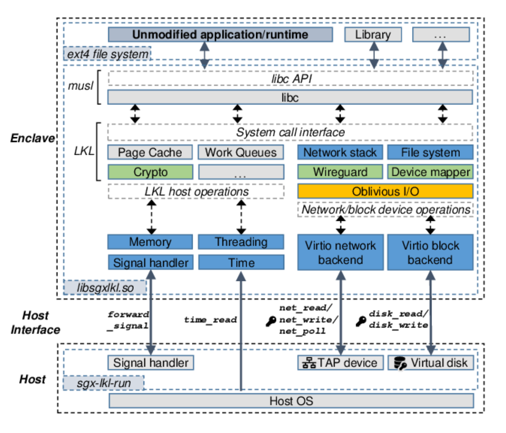

**Figure**: *SGX-LKL is a library OS running inside of enclaves. The same approach now applies to CVMs.*

### Process-like VM(pVM)

Library OS have proved pivotal in porting applications to new platforms with minimal effort on the developer side. In the same spirit, efforts have been developed to generalize this approach for different architectures. For instance, the same libOS could be used to run an application in a TDX / SEV CVM or on Intel SGX. To achieve this, a baseline libOS is compiled into a [unikernel][] that can run on
a virtual machine while providing the same API on different platforms. Such a solution turns a virtual machine into a single-purpose virtual machine called a virtual appliance as shown in the Figure below. This solution would turn a VM-based TEE into an approximation of a Process-based TEE.

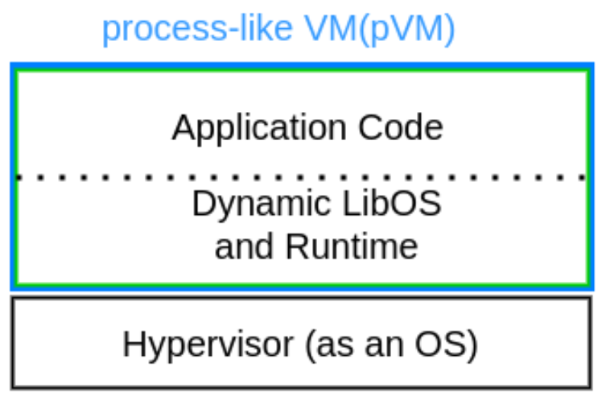

**Figure**: *A single process virtual machine.*

Compared to traditional VMs, Unikernel appliances have smaller TCB and lower overhead while guaranteeing the same level of isolation. A good example of this solution is Kylinx and Gramine-TDX. On the downside, this approach strips off the process abstraction from its monolithic appliance and thus sacrifices flexibility, efficiency, and applicability.

pVMs enable a single application to be able to exploit a solution like AMD SEV and Intel TDX without the need of running a full OS. This means faster boot times and likely better adoption in mobile devices, where power management would adversely be affected by running several full-scale VMs. To further improve multiparty computation, several pVMs can be deployed working collaboratively over shared
IPC or memory to either emulate multiprocessing or avail individual serviceswhile still maintaining their relative isolation. Such an architectural approach is shown in the Figure below.

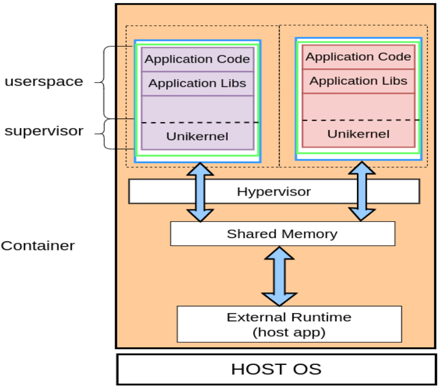
**Figure**: *A container featuring an application hosting to virtual machines. The two pVM, spanning user and kernel spaces in a VM, collaborate with the host application and each other via shared memory as shown. This link could be used to emulate functionality and non-sensitive state in the host. The disadvantage of this approach is that we have to have on CVM per process and hence, potentially multiple CVMs per container. This can introduce quite dramatic overheads in spawning applications and containers.*

### Microkernel and libOS Solution

With CVMs, it might be desirable to avoid a single address space, as was the case above, or relegate some operations to a hosting OS. At the same time, having a minimum possible TCB would improve the performance of an application. As a solution, one might run a minimal kernel to handle memory management, interrupts and scheduling, and delegate the rest of the functionality to a libOS. This possible setup is shown in the below Figure.

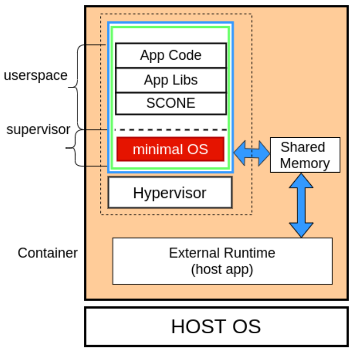

An existing libOS, like SCONE, which has an enclave and external runtime, can be ported to CVMs using this approach. The external runtime is responsible for creation of the CVM, which would approximate an SGX enclave, and it can communicate and share state with the CVM through shared memory. This approach allows use of existing infrastructure to support new platforms and TEE environments. Running the solution in a container will allow leveraging deployment solutions already in existence.

When multiple services must be combined to meet a business or computation
goal, the minimal-OS libOS solution can be extended as shown in the Figure below.
In this case, a container hosts two or more VM-based enclaves, each of which
is running an appropriate software for the computation. The external runtime keeps some state while also coordinating and performing system calls on the
host OS on behalf of the applications in the VMs. The simplest instance of
this incarnation is when a single application uses fork system call semantics
for computation. When this operation is complete, a new VM with a copy of
parent VM can be constructed. Further extension would enable spawning of
new application into a new VM after a call of execve system call.

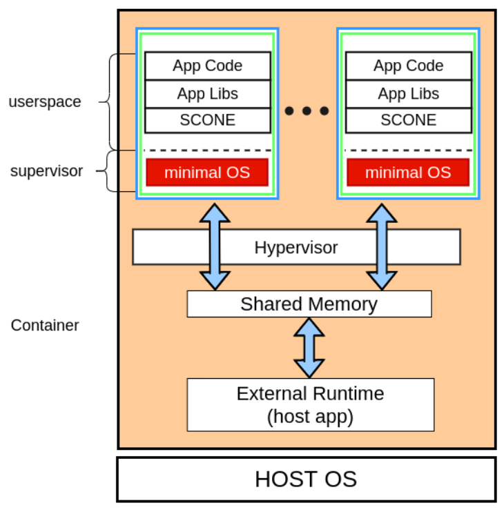

**Figure**: *Collaborating services each run in an isolated CVM.*

## Supporting CVMs in Shared Environments

In what follows, we focus on using CVMs to provide confidential cloud-native applications in context of shared environments. In this context, the Kubernetes node runs inside of a (C)VM.

### Kubernetes Nodes are CVMs

To protect the Kubernetes node against attacks by the infrastructure provider, we should run the Kubernetes nodes inside of CVMs.

Note that there are some limitations in case the Kubernetes node runs inside a CVM (using current generation of CPUs):

- CVMs cannot be nested. A CVM cannot spawn a nested CVM for pods or applications.

- Intel SGX enclaves cannot be created inside of a TDX-based CVM.

Note that one can emulate nested CVMs as follows:

- one provide an API to the L0 VMM to create a new CVM
- one attests the CVM and communicates with the CVM via a secure channel

This emulation of nested CVMs is not supported by all cloud providers:

- A general limitation is that this spawning of nested CVMs will affect the scheduling in the cluster. One option is that the cloud provider reserves the resources needed by the nested CVMs at the time the parent CVM is created.

- The cloud provider must provide an API to the L0 VMM from within the CVM to create nested CVMs.

Azure supports the creation of CVMs from within native VMs. The resources are allocated at the time when the native VM is created. The VM can create CVMs via an API provided by the L0 VMM.

#### Kubernetes Admins are trusted

In case the Kubernetes admins are trusted, it is sufficient to run the Kubernetes nodes inside of CVM to protect an application. Please note that according to our adversary models, no admin nor user in the runtime environment can be trusted. This means that just running a Kubernetes node inside of a CVM is not sufficient because it does not isolated the confidential applications from the admins and users that have access to the runtime environment.

#### Kubernetes Admins are untrusted

In case of our adversary models, we cannot trust the admins. We need additional isolation of the confidential applications and services from the admins and the operating system (which is controlled by the admins).

In case the infrastructure provider and the Kubernetes provider are different entities, it might makes sense to run the Kubernetes nodes inside of CVMs.

### Kubernetes Nodes are VMs

In case of Intel SGX or Azure, we might need to run the Kubernetes inside of VMs. In the case of SGX, we can isolate the confidential applications and services by running them in isolated memory regions (i.e., inside of enclaves).

In case of Azure, one can spawn CVMs from VMs. Technically, these CVMs are peers of the VM. Logically, the VM is the "parent" of the CVMs. The CVMs get their resources from the "parent" VM. Hence, we might isolate the confidential applications and services using such "virtually" nested CVMs.

Independently, if the Kubernetes Node runs as CVM or VM, we have the following options to protect confidential applications and services.

#### Pod as CVM

We can run each pod in an isolated CVM. This approach is implemented by Kata / Coco. The creation of a pod spawns a new CVM. The creation time of a pod can be substantially longer than creating a local pod since one needs to create a new CVM. In practice, we measured delays of multiple minutes to create a new pod (on two of the hyperscalers).

Note that if the CVM is created on a different host, all the communication with the pod is forwarded via a secure network connection. This might includes log traffic, network traffic, and volume traffic. This can have a noticeable impact on performance.

As Azure supports the (virtual) nesting of CVMs inside a VM, the creation of CVMs appear to be faster and the runtime overheads appear to be lower.

#### Container as CVM

One could also run each container in a CVM. This approach is taken by [Quark](https://github.com/QuarkContainer/Quark). Quark supports spawning of CVMs. Right now, Quark only seems to be supported by a cloud operated by Huawei. Extensions to run the containers in CVMs are implemented in some research prototypes.

The main problem in this context is that the prototypes - we are aware of - assume that the Kubernetes node runs on baremetal, i.e., this approach does not yet support cloud deployments. The disadvantages of slow startup times apply to containers running as CVMs (as discussed above for pods).

#### Processes as CVM(s)

In SGX-based systems, processes run inside of enclaves. All interactions with the operating system are protected by **shields**. To isolate processes running inside of CVMs, one has the following options:

- In the context of TDX machines, one could create the enclaves in a separate VM, i.e., the Kubernetes node runs inside of a CVM and the processes run inside of SGX enclaves. This would require some shared memory (aka bounce buffers) between the VM and the CVM. This part would - given current CPUs - be visible to the L0 VMM.

- One could spawn for each process a CVM. This could increase the startup times for individual processes from milliseconds to minutes. This would introduce dramatic performance and cost overheads (- given that we need to pay for each CVM that is started).

- One could isolate the confidential processes within the CVM of the Kubernetes node, i.e., we can emulate enclaves with the help of a L1 supervisor (we call this a **TEEVisor**).  This would reduce the resource and cost overhead since spawning enclaves is quite efficient in comparison to running a new CVM for each process or even for each pod. All communication is local within the CVM and protected from access by the infrastructure provider. The Kubernetes admin and the Linux admin of the Kubernetes node cannot look inside of the emulated enclaves.

### Discussion

To ensure good performance, including fast startup times and low resource usage, each Kubernetes node should require only a single Confidential VM (CVM).

To achieve strong security, where no trust is placed in runtime administrators, confidential applications should be isolated at the process level.

However, performance and security alone are not enough — the solution must also offer ease of use to be practical in real-world deployments.

## Secure Configuration and Ease of Use

One of the main security issues that we have regarding confidential applications is that we need to attest these application (i.e., establish trust) and then, we need to configure the applications securely.

One of the open issues is on how to ensure that we can configure applications securely. Ideally, we would like to configure the applications using standard Kubernetes approach (i.e., using **ConfigMaps** and **Secrets**). This would, however, imply that we need to trust the Kubernetes admins. According to our adversary models, we cannot trust any admin that has access to the runtime environment - which includes the Kubernetes administrators.

## Attestation

Attestation is an essential component to establish trust into components of our TCB (Trusted Computing Base). Attestation provided by hyperscaler is, however, not sufficiently secure yet. We introduce some attacks on attestation to raise the awareness of such attacks.

Moreover, we introduce in the next section the requirements regarding an infrastructure provider to be able to establish trust with our applications.

### Attacks on Attestation

There are known attacks on attestation mechanisms like:

- **Evidence Factory Attack**, i.e., a malicious CVM (Confidential VMs) or enclave could manufacture a valid attestation report. For example, CoCo (Confidential Containers), workload in CVM use attestation report with same measurement to prove itself. This can allow malicious workload to get secret from different party if workload can gain access to guest user space and get valid report.

- **Attestation reuse attack**, i.e., an enclave / CVM of adversary can impersonate a valid enclave / CVM if not all components of a CVM are measured. For example, we might measure the Python engine but not the Python program that executes inside of the Python engine. A Python program can take over the Python engine and change the behavior maliciously - even though the measurement is the same as for the valid enclave / CVM.

#### Dynamic Binding with Nonce

One could think that adding a unique random number (aka nonce) to the enclave / CVM measurement would be sufficient to solve these attacks. This is, however, not the case since an adversary could start an enclave / CVM with the same nonce after first attesting to an attestation service that the adversary controls to change the behavior of the CVM.

#### Dynamic Attestation & Policy Binding

The SCONE attestation approach is to embed a reference to the CAS (its public key), a nonce generated by CAS, and a reference to a unique security policy stored on that CAS in the enclave. SCONE CAS calls this a singleton enclave.  

SCONE Singleton Enclaves ensure that each enclave is uniquely identifiable against attestation reuse attacks in which the adversary exploits the enclave before it connects to CAS. Typically enclaves containing the same software cannot be distinguished via attestation making it impossible to ensure the freshness of an enclave, i.e., ensuring that the enclave has not been used before. Therefore, an adversary that can control the enclave could load code that pretends to be a fresh enclave and illegitimately obtain secrets from CAS. With SCONE Singleton Enclaves, CAS is able to verify each enclave's freshness, essentially preventing these attestation attacks.

#### Confidential Provisioning of Applications

To mitigate attestation attacks, we need to

- bind attested components to **unique measurement**, i.e., each application has a unique measurement that can be derived from some base measurement and some unique ID of the component,

- the attested component must be able to prove that it is the *owner* of an ID, i.e., the ID is typically a public key belonging to a random public private key pair generated by the component,

- a unique ID is not sufficient to prevent some of the attestation attacks (see above), a component must additionally be tied to unique policy and a unique configuration and attestation service. This ensures that an adversary cannot change the behavior of the component (as long as the configuration of the components is determined by the policy).

## Requirements for Infrastructure Provider

The infrastructure provider operates the cloud to run CVMs. Our threat model states that we cannot trust the infrastructure provider If the cloud provider is part of the attestation infrastructure to establish trust in CVMs and confidential applications, the infrastructure provider becomes implicitly part of the TCB.

To be able to remove the infrastructure provider from the TCB (Trusted Computing Base), an infrastructure needs to provide the following aspects:

- **Trust in the measurement and attestation mechanisms**. Can we indeed trust the measurement and attestation infrastructure?

- **Measurement of the complete TCB** such that application owners can establish trust in the CVMs they use to run applications.

- **Trust in the measured values**. Can we indeed trust the measured values, i.e., do we know what software is executing?

- **Dynamic binding of CVMs**. Can we indeed ensure that the attested CVM is not a CVM operated by a different entity? Can we ensure that confidential programs are indeed running in a given CVM?

- **Support for different [Trust Levels](#support-for-multiple-trust-levels-inside-of-cvms)**. Can we isolated the application running inside of a CVM from the operating system.

- **Ensuring that CVMs are not migratable**. In the context of TDX, migration within a **trust domain* is facilitated by the Intel Trust Domain module. This extends the TCB of an application and delegates the control over acceptable destination hosts to Intel. Hence, an application owner needs to be able to switch off CVM migration. This switch must be verified during attestation. Instead of migrating a CVM, the infrastructure provider can add a new node to a cluster.

We discuss these aspects in what follows.

### Trust in the measurement and attestation mechanisms

We need to establish trust in the attested measurements of the TCB during load time of the CVM and also during the runtime of the CVM. Typically, we have a chain of measurements and we need verify to establish trust in a given CVM.

We cannot establish trust in these measurements if the measurement was done by a hardware or software component that can be controlled by the infrastructure provider. Let us explain this in the context of measuring the booted operating system kernel. On the host level, we can measure the kernel with the help if a [TPM (Trusted Platform Module)][17] - a secure coprocessor that can be remotely attested. A hardware TPM cannot be virtualized. Hence, the hypervisor emulates a TPM in software. This software-emulation of a TPM is called a virtual TPM (vTPM).  When using a vTPM - provided by the hypervisor of the cloud provider - to measure the operating system kernel, we have the problem that the measurements could be manipulated.

**(R1)** The first requirement is that all entities that measure parts of the TCB must themselves be measured by a component that was already measured and each of these measurement components is protected by a TEE.

Practically, this means that we need to have a Root of Trust in the platform that we establish trust in with the help of the CPU manufacturer. This measurement has to be done during deployment but also after each update of the CPU microcode or attestation infrastructure.

**(R2)** We need to be able to evaluate that no component of the measurement infrastructure has a known vulnerability. It is not sufficient to ensure that the infrastructure is up-to-date since some vulnerabilities might not be fixed for a certain CPU generation, i.e., an application provider might need to move the execution to hosts with different CPUs.

In case of Intel CPUs, we can query the known vulnerabilities for all components of the TCB and check if patches are available or if a given CPU type does not provide any patch patch for given vulnerabilities (yet).

### Measurement of the complete TCB

We need to measure the software components that are used to start the CVM (e.g., code, configuration info, kernel parameters, firmware, etc). The practical problem is that hyperscalers might only measure parts of the TCB like only the firmware of the CVM but not other components. Such incomplete measurements are insufficient to establish trust with a CVM.

One needs to provide measurements during

- **load time** of the CVM, i.e., components that are executing until the OS is running. Typically, we see a chain of measurements, i.e., that one component measures the next components in the boot chain.

- **runtime** of the CVM, i.e., measure all programs that are started in the CVM. Process could be seen as a tree but during the runtime we get a sequential log of runtime measurements.

**(R3)**  **Load time measurements**  need to include all components that affect the operating system:

- **CPU-related** measurements like 1) the Secure Processor software in case of AMD SEV SNP, and 2) the CPU hardware, CPU microcode, the quoting enclaves, the TDX Module in case of Intel TDX

- the **firmware** that is started within the CVM. The firmware implements UEFI functionality like access to the vTPM. Hence, the firmware is critical in the context of attestations

- the **boot loader(s)**, i.e., the component that loads the kernel. There might be some intermediate steps to load the kernel. For simplicity we refer to them as belonging to the boot loader.

- the **supervisor code** might implement part of the TCB like a vTPM inside the CVM (AMD SEV SNP). Note that the firmware needs to connect to the local vTPM. In the context of Intel TDX, the vTPM is implemented by the TDX Module - which is part of the TCB.

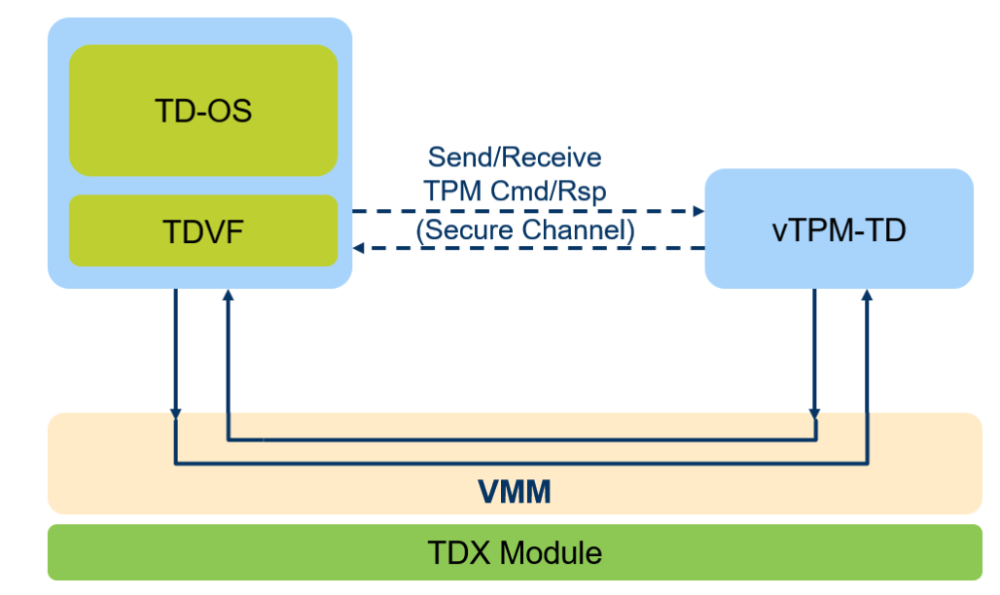

**Figure** [[vtpmtd](https://github.com/intel/vtpm-td)]: *vTPM support in the context of Intel TDX is provided by the TDX Module.*

- the **kernel arguments**, i.e., the security posture of the Linux kernel is affected by the kernel arguments. Hence, the measurement of the CVM must include all kernel arguments.

- the **kernel** must be measured to ensure that the correct kernel is loaded. The measurement must include all parts of the kernel that affect the security and the functionality of the kernel.

### Load Time vs Runtime Measurements

To establish trust in a CVM, one needs to measure the complete TCB, i.e., the code that was executed during load time but also the code that was executed during runtime, i.e., all applications that might affect the security of the confidential applications running inside of a CVM.

In the simplest case, we could assume that only applications that are effectively executed by the root user can affect the behavior of the CVM. The behavior of these programs with *root privileges* are determined by their command line arguments, environment variables, and configuration files. We need to ensure that all configuration data and arguments of the root programs are measured.

For example, if a Python engine would be executing by root but the Python program itself is owned by a non-root user, a non-root user could modify the behavior of the CVM, e.g., change owners of certain files such that they run with root privileges. Typically, one sets up a system that programs running with root privileges only read configuration files owned by the root users. However, this intended behavior can be modified via arguments and environment variables. Hence, one should also measure these.

Some of the arguments and environment variables of the root programs are determined during runtime, i.e., a script running with root privileges determines the system state to determine the arguments for another program that also executes with root privileges. In other words, the correct measurement values are not always predictable since they depend on the execution environment. In other words, it is technically difficult to measure the complete TCB and be able to verify the measured values. Still, it makes sense to measure all files owned by the root users.

**(R4)** Measurements of all applications that have root privileges and measurement of all files that are owned by the root user.

#### Intel TDX Measurements

Intel TDX implements four runtime measurement registers (`RTMR[0-3]`). They are used for load time and runtime measurements. By convention, they are used as follows:

- **`RTMR[0]`**: Is used to measure the virtual firmware, e.g., TDVF (Trust Domain Virtual Firmware), and the firmware configuration.

- **`RTMR[1]`**: measures the OS code, e.g., kernel image.

- **`RTMR[2]`**: measures the boot configuration, e.g., command line parameters and initrd.

- **`RTMR[3]`**: is leveraged by runtime integrity monitoring systems (Linux IMA) for load time measurements of applications and file access - typically on those performed by the root user.

Note that for IMA (Linux Measurement Architecture), one needs to modify the kernel to support `RTMR[2]` for kernel arguments and `RTMR[3]` for IMA.

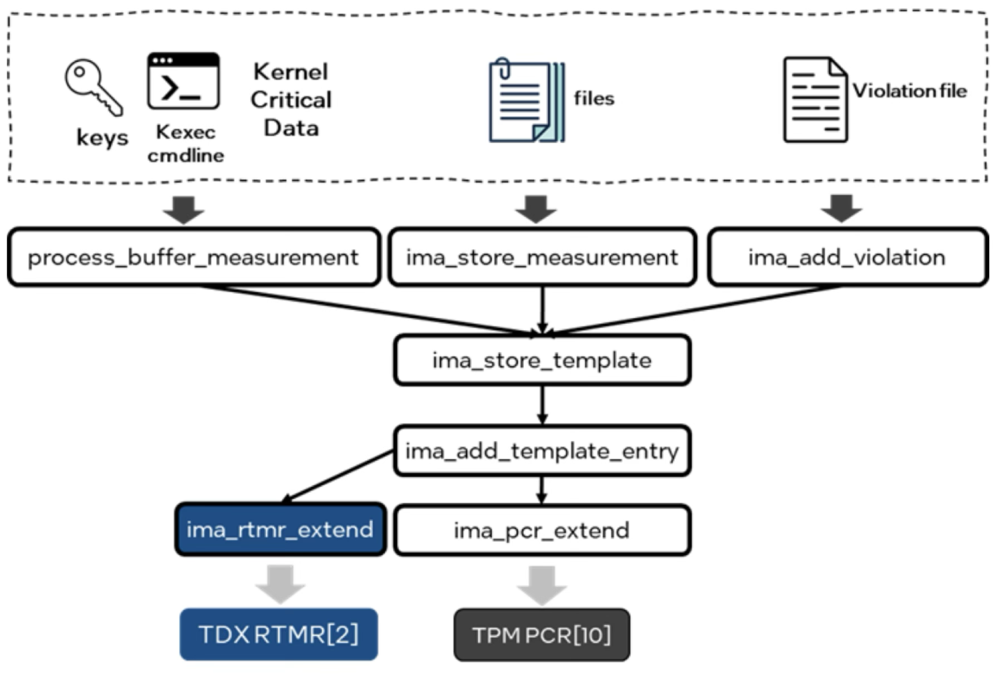
**Figure** [Runtime Measurements](https://www.intel.com/content/www/us/en/developer/articles/community/runtime-integrity-measure-and-attest-trust-domain.html): *Use of RTMR registers requires kernel changes.*

To use a standard IMA kernel modules, one could instead use the vTPM provided by the TDX Module (see above). This means that one depends on ensuring the the firmware of the CVM indeed connects to the vTPM implemented by the trusted TDX Module.

**(R5)** For Intel TDX, we need to enable the measurements provided by RTMR registers. IMA must be supported either via direct measurements using `RTMR[4]` or via the vTPM provided by the TDX Module. The advantage of using a vTPM implemented in the TDX module is that 1) we can use upstream IMA code - no need to patch for RTMR, and 2) the same IMA code would work for AMD SEV SNP.

An alternative to using IMA is to use SGX-like measurements. This can be implemented transparently within the CVM using a vTPM or RTMR. The advantage of SGX-like measurements would be that

- one associates each measured enclave with a unique public key
- there is no need to measure native processes, and
- we need this SGX-like measurement anyhow to configure confidential processes.

### Trust in the measured values

We need to ensure that the measured and attested load time and runtime measurements are associated with some known source code. For example, we might verify that a certain firmware version **FV** indeed connects to the vTPM provided by the TDX Module. In this case, we need to ensure that the measured value **MV** of the firmware is the same as the expected value **ExpV** that we determined for **FV**.

Some of the builds might be non-deterministic, i.e., the same source code might result in different expected measurement values depending on the exact versions of the compilers and even the time of day and exact execution order during compilations. In this case, we assume that the build was done in the context of a trusted execution environment, i.e., one can prove that **ExpV** indeed belongs to **FV**.

A better approach is that the computation of **ExpV** is deterministic, i.e., anybody who has access to **FV** and the right version of the tool chain, can compute **ExpV**.

**(R6)** We need evidence for each component of the TCB that a given **ExpV** belongs to a certain version of the source code.

### Dynamic Binding of CVMs to Owner

In current offerings by hyperscalers, one might only get a simple signed quote of the firmware of the CVM. This quote might be the same for all CVMs. Hence, the quote might actually be forwarded by another CVM, i.e., it is not sure that the quote is not reused from some golden CVM that forwards the measurement (a kind of Cuckoo attack - see above).

What we need to ensure is that the load time measurements and the runtime measurements are tight to the confidential application that an application provider wants to protect with CVM. Looking more closely into this problem from an application perspective, we need to tie the application and the CVM not only to given identity but also to a given policy (see attacks above). 

**(R7)** We need to be able

- to establish a secure channel to an application and the application needs to prove (via mTLS) that it know the private key for a given public Key **Pub**,

- **Pub** must be part of the runtime measurement, i.e., we can verify that **Pub** is associated with a given CVM for which we performed the load time and runtime measurements / attestation,

- an adversary could configure that application in a different way (see above Python example), i.e., while the measurement for the application is as expected, the behavior of the program is different. Hence, we need to ensure that the measurements also include the configuration and attestation policy that was used to run this confidential application, and

- we need to give the CVM a unique ID and policy to ensure that the measurements belong to a given CVM guided by a given policy.

### Support for multiple Trust Levels inside of CVMs

AMD SEV SNP provide four different trust levels (VMPL0-3). This permits to implement a vTPM inside of VMPL0 that be protected from code that runs on levels VMPL1-3.

Intel TDX supports different trust levels via the concept of TD Partitioning. One can implement a L1 VMM (aka paravisor) inside the CVM to run unenlightened VMs inside the CVM and isolate the VM from the L1 VMM.

The trust levels can be used to implement a security monitor, i.e., we can remove the operating systems from the TCB by running it in a sandbox inside of the CVM.

**(R8)** the infrastructure provider must support different trust levels (at least two) and an API to switch between the trust levels.

In the context of TD Partitioning, this API is called the **TDX Guest-Side API** and it is implemented by the TDX Module. This guest side API can be used to create enlightened and legacy VMs inside of the CVM.

### CVM Migration

Supporting VM migration extends the TCB since we need to ensure that migration of VMs does not introduce new attacks. For example, we need to ensure that migration mechanism cannot be used to duplicate the functionality running inside of a CVM. This "replication attack" could, for example, be used to violate the requirements of a consensus protocol implemented by a CVM.

In the context of Kubernetes clusters, we do not need the migration of CVMs. Neither the Kubernetes nodes nor the pods need to be migrated. Whenever some node or pod needs to move, it is restarted. This restart mechanism is anyhow needed to update the software of the Kubernetes nodes as well as the software of the pods.

**(R9)** We must be able to switch off migration of CVMs. The attestation of the CVMs must measure that migration is not possible.

Note that Kubernetes can shut down (C)VMs by creating a new Kubernetes node first to ensure we have sufficient resources in a cluster and then drain the Kubernetes node that we want to shut down.

## Proposed Architecture and Implementation

Our approach to achieve **(T1)** and **(T2)** is as follows:

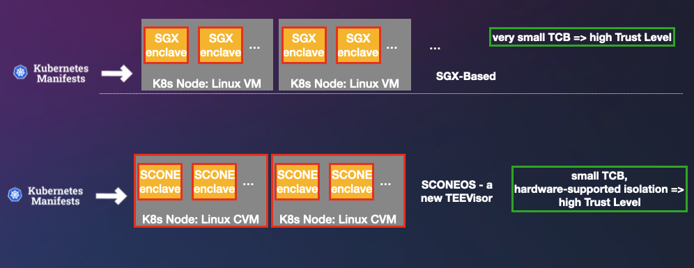

- **(D1)** We implement **software-based enclaves** within a **Confidential Virtual Machine (CVM)** such that neither the operating system nor any other software running inside the CVM can access the enclaves.

  - The enclaves support the spawning of **local pods**, similar to a native Kubernetes node—i.e., without introducing additional latency or resource overhead, unlike the overhead associated with solutions like Kata or CoCo.
  - **Inter-Pod Resource Sharing**: Resources within the CVM are shared among the pods.
  - **Fast Startup Times**: Containers within a pod launch directly inside the Kubernetes node with minimal delay.

- **(D2)** Attestation is extended beyond traditional SGX-based attestation to cover both the **Confidential Virtual Machine (CVM)** and the **application running inside the enclave**.

  - This extended attestation mechanism is already implemented on top of **CoCo**, allowing us to attest **individual enclaves** running inside a CVM. 

  - With this attestation capability, we can **securely configure attested, confidential microservices**. Sensitive resources such as **Secrets** and **ConfigMaps** are mapped directly into the enclave, ensuring that:
    - They are **not accessible inside the container**, and  
    - They remain **invisible at the Kubernetes level**.

  - we ensure that the attestation of a CVM that does not permit "evidence factory attacks". Such an attack is similar to "Cuckoo Attacks for TPMs". A VM or a CVM under the control of an adversary can pose as CVM configured and controlled by the application owner. We ensure this by ensuring that the measurement of a CVM or an enclave is unique and includes the hash of the security policy.

- (D3) enclaves can load unmodified applications. Support of forks and shared memory is supported.

- (D4) configuration of the enclaves is done based on Kubernetes manifests

  - admins do not need to learn new manifests **(No New Manifests)**
  - the manifests are automatically transformed into sanitized manifests using either a generic build pipeline (for production) or a transparent proxy (for development)

- (D5) Encrypted Manifests

  Kubernetes nor Linux are trusted. The Kubernetes manifests a therefore sanitized - see (D4). The components that containing application specific configurations (like Secrets and ConfigMaps) are transformed  into signed (integrity protection) and encryped (confidentiality protection) manifests which cab ibk

- (D6) Sandboxing and Shielding

  Enclaves are associated with shielding such that enclaves can be sandboxed - addressing requirement **(Secure Sandboxing)**. The sandboxing is under policy control. For example, we can ensure that all network and file traffic must be encrypted with keys that are only accessible within the application.

## Summary

Comparison of the proposed approach (T1-2) with Confidential Containers (CoCo):

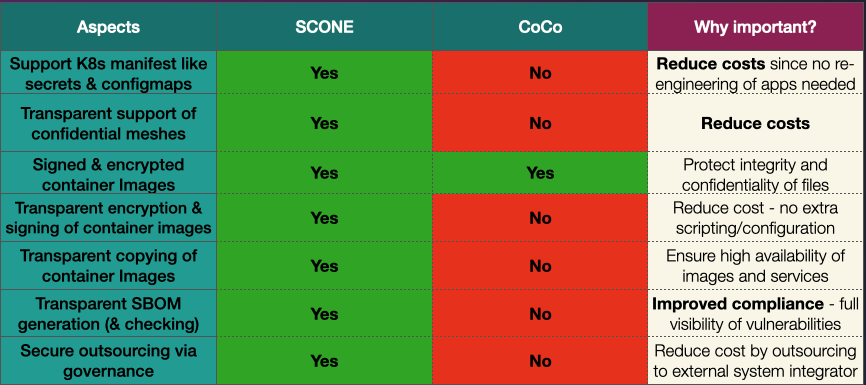

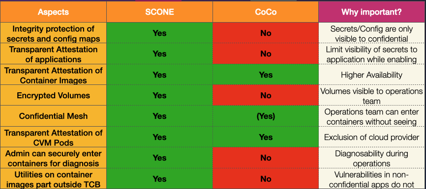

## References

[1]: <https://en.wikipedia.org/wiki/Trusted_execution_environment>
\[1] <https://en.wikipedia.org/wiki/Trusted_execution_environment>

[2]: <https://en.wikipedia.org/wiki/Confidential_computing>
\[2] <https://en.wikipedia.org/wiki/Confidential_computing>

[3]: <https://en.wikipedia.org/wiki/Software_Guard_Extensions>
\[3] <https://en.wikipedia.org/wiki/Software_Guard_Extensions>

[4]: <https://en.wikipedia.org/wiki/Trust_Domain_Extensions>
\[4] <https://en.wikipedia.org/wiki/Trust_Domain_Extensions>

[5]: <https://www.amd.com/en/developer/sev.html>
\[5] <https://www.amd.com/en/developer/sev.html>

[6]: <https://www.arm.com/architecture/security-features/arm-confidential-compute-architecture>
\[6] <https://www.arm.com/architecture/security-features/arm-confidential-compute-architecture>

[7]: <https://kubernetes.io/docs/concepts/configuration/secret/>
\[7] <https://kubernetes.io/docs/concepts/configuration/secret/>

[8]: <https://kubernetes.io/docs/concepts/configuration/configmap/>
\[8] <https://kubernetes.io/docs/concepts/configuration/configmap/>

[9]: <https://kubernetes.io/docs/tasks/administer-cluster/encrypt-data/>
\[9] <https://kubernetes.io/docs/tasks/administer-cluster/encrypt-data/>

[10]: <https://www.supermicro.com/en/glossary/smart-nics>
\[10] <https://www.supermicro.com/en/glossary/smart-nics>

[11]: <https://cloud-init.io/>
\[11] <https://cloud-init.io/>

[12]: <https://www.intel.com/content/www/us/en/security/security-practices/secure-development-practices/threat-modeling.html>
\[12] <https://www.intel.com/content/www/us/en/security/security-practices/secure-development-practices/threat-modeling.html>

[13]: <https://en.wikipedia.org/wiki/Secure_by_design>
\[13] <https://en.wikipedia.org/wiki/Secure_by_design>

[14]: <https://sconedocs.github.io/>
\[14] <https://sconedocs.github.io/>

[15]: <https://en.wikipedia.org/wiki/OS-level_virtualization>
\[15] <https://en.wikipedia.org/wiki/OS-level_virtualization>

[16]: <https://github.com/olivierpierre/unikernel-papers>
\[16] <https://github.com/olivierpierre/unikernel-papers>

[17]: <https://en.wikipedia.org/wiki/Trusted_Platform_Module#:~:text=A%20Trusted%20Platform%20Module%20(TPM,and%20storing%20disk%20encryption%20keys>
\[17] <https://en.wikipedia.org/wiki/Trusted_Platform_Module#:~:text=A%20Trusted%20Platform%20Module%20(TPM,and%20storing%20disk%20encryption%20keys>

[18]: <https://cdrdv2-public.intel.com/733585/tdx-virtual-firmware-design-guide-rev-004-20231206.pdf>
\[18] <https://cdrdv2-public.intel.com/733585/tdx-virtual-firmware-design-guide-rev-004-20231206.pdf>

[19]: <https://www.usenix.org/system/files/sec22-alexopoulos.pdf>

\[19] Nikolaos Alexopoulos, et al., "How Long Do Vulnerabilities Live in the Code? A Large-Scale Empirical Measurement Study on FOSS Vulnerability Lifetimes", Unix Security, 2022, <https://www.usenix.org/system/files/sec22-alexopoulos.pdf>

[20]: <https://www.cvedetails.com/top-50-products.php>
\[20] <https://www.cvedetails.com/top-50-products.php>

[21]: <https://security.googleblog.com/2022/12/memory-safe-languages-in-android-13.html>
\[21]: <https://security.googleblog.com/2022/12/memory-safe-languages-in-android-13.html>

[22]: <https://en.wikipedia.org/wiki/Rust_for_Linux>
\[22]: <https://en.wikipedia.org/wiki/Rust_for_Linux>

[23]: <https://github.com/torvalds/linux>
\[23]: <https://github.com/torvalds/linux>

[24]: <https://en.wikipedia.org/wiki/Trusted_computing_base>
\[24]: <https://en.wikipedia.org/wiki/Trusted_computing_base>

[25]: <https://www.youtube.com/watch?v=aMkCKeZ8xZw>
\[25]: <https://www.youtube.com/watch?v=aMkCKeZ8xZw>

[26]: <https://en.wikipedia.org/wiki/Merkle_tree]>
\[26]: <https://en.wikipedia.org/wiki/Merkle_tree]>

[27]: <https://en.wikipedia.org/wiki/Virtual_machine>
\[27] <https://en.wikipedia.org/wiki/Virtual_machine>

[28]: <https://en.wikipedia.org/wiki/WebAssembly>
\[28] <https://en.wikipedia.org/wiki/WebAssembly>

[29]: <https://sconedocs.github.io/network_shield/>
\[29] <https://sconedocs.github.io/network_shield/>

[30]: < https://cointelegraph.com/news/brazil-central-bank-service-provider-hacked-140-million>
\[30] < https://cointelegraph.com/news/brazil-central-bank-service-provider-hacked-140-million>

[31]: <https://en.wikipedia.org/wiki/Two-person_rule>
\[31] <https://en.wikipedia.org/wiki/Two-person_rule>

[32]: <https://www.ncsc.gov.uk/information/secure-default>
\[32] <https://www.ncsc.gov.uk/information/secure-default>

[33]: <https://www.namutech.io/blog/cost-benefit-analysis-virtual-machines-vs-containers?utm_source=chatgpt.com>
\[33] <https://www.namutech.io/blog/cost-benefit-analysis-virtual-machines-vs-containers?utm_source=chatgpt.com>

[34]: <https://confidentialcontainers.org/>
\[34] <https://confidentialcontainers.org/>